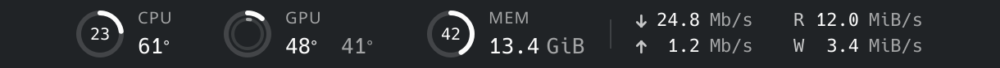

# Ringside

CPU, GPU, memory, network and disk at a glance in a KDE Plasma 6 panel.



Each item is a ring or a pair of rates. Click one for a popup under it with
history graphs, per-thread load, top processes, VRAM, clocks, power, swap,
memory pressure and disk activity.


- **CPU**: usage ring and temperature.
- **GPU**: a discrete GPU on the outer ring and an integrated one on the inner
  ring, with their temperatures. With one GPU there is one ring.
- **Memory**: usage ring and the amount in use.
- **Network**: download and upload rates.
- **Disk**: read and write rates. Hidden by default; the network popup shows
  disk activity too.

Temperatures turn amber and red above thresholds you set, and colours follow
your Plasma theme. On a vertical panel the items show their rings, tinted when
hot, with the readings in a tooltip.

### Discrete GPUs on laptops

Reading a GPU's sensors keeps it awake. A laptop's discrete GPU normally
powers down when nothing uses it, so Ringside reads it only while something
else has woken it, lets go after about ten idle seconds so it can power down
again, and shows **off** while it sleeps. Opening the GPU popup never wakes
it.

Other widgets that show the same GPU's sensors, such as Plasma's own GPU
monitors, keep it awake regardless. So does restarting ksystemstats in the
middle of a session, until Plasma restarts.

## Requirements

- KDE Plasma 6.0 or later. Tested on Plasma 6.7 with KDE Frameworks 6.30 and
  Qt 6.11.
- ksystemstats and libksysguard, which come with Plasma's System Monitor and
  are part of any standard Plasma 6 install.
- Memory pressure needs Plasma 6.2 or later. Intel GPUs need 6.4 or later with
  the i915 driver, or 6.8 or later with xe, and report no temperature or VRAM.
  Without those, the parts are left out.

## Install

```bash
git clone https://github.com/emilyhamedian/ringside.git
cd ringside
scripts/install.sh
```

Then add **Ringside** to a panel from *Add Widgets*.

To update:

```bash
git pull
scripts/install.sh
systemctl --user restart plasma-plasmashell
```

Plasma keeps running the old version until plasmashell restarts. The command
above works where systemd starts Plasma, the default on most distributions;
otherwise log out and back in. Restarting the service also stops anything
started inside it, which `systemctl --user status plasma-plasmashell` lists.

To uninstall, remove the widget from the panel, then:

```bash
kpackagetool6 --type Plasma/Applet --remove dev.emily.ringside
```

## Settings

Right-click the widget and choose *Configure Ringside*.

- **General**: update interval, how far back the graphs reach, Celsius or
  Fahrenheit, network rates in bits or bytes, temperature highlight thresholds.
- **Panel Items**: which items show and in what order, rings with or without
  their text, ring size.
- **Sensors**: the CPU temperature source, which GPU goes on which ring, the
  network interface, the disk and volume, and the disk temperature sensor.

## What it reads

Readings come from ksystemstats, the service behind Plasma's System Monitor.
A small shell script,
[`ringside-info.sh`](package/contents/code/ringside-info.sh), fills in what
ksystemstats doesn't publish: the CPU model, memory module type and speed,
GPU marketing names and which GPU is integrated, the disks and the one holding
`/`, the default network route, and whether the discrete GPU is asleep. It
reads `/proc`, `/sys` and udev's database as your user and needs no root.
Nothing leaves the machine.

## Development

```bash
sh scripts/test.sh      # qmllint, the QML tests and the helper's fixture tests
sh scripts/gallery.sh   # renders the strip and every popup to /tmp/ringside-gallery.png
```

Both run on a Plasma 6 desktop and look for the Qt 6 tools in
`/usr/lib/qt6/bin` and `/usr/lib64/qt6/bin`; set `QMLLINT`, `QMLTESTRUNNER`
or `QML` to point elsewhere.

## License

GPL-3.0-or-later. See [LICENSE](LICENSE).
