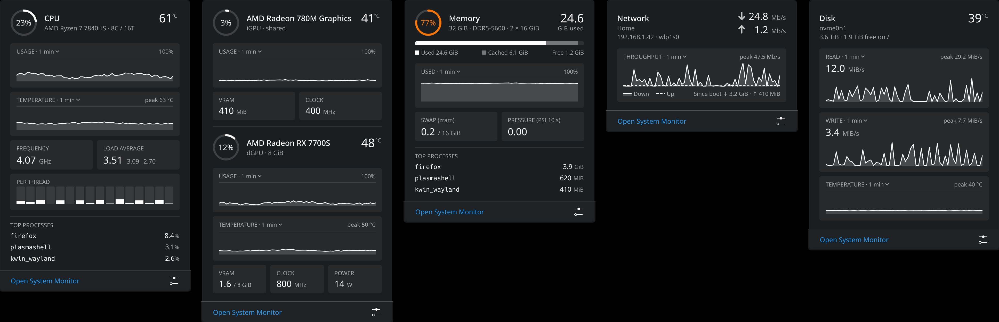
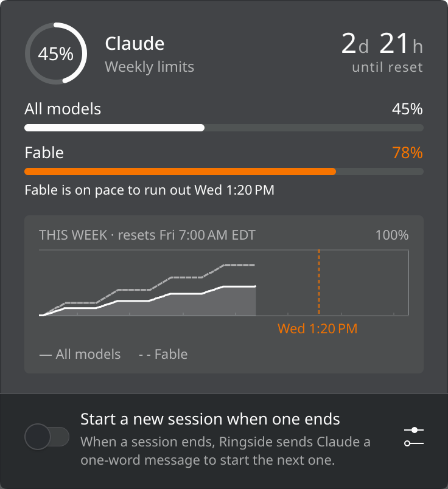

# Ringside

[](https://github.com/emilyhamedian/ringside/actions/workflows/test.yml)
[](https://github.com/emilyhamedian/ringside/releases/latest)
[](LICENSE)

CPU, GPU, memory, network and disk in a KDE Plasma 6 panel, and your Claude
and Codex usage limits if you want them.


Each item is a ring with its name inside and its readings beside it, or a
pair of rates. Each item keeps room for its widest readings, so the panel
stays the same width as the numbers change. Across a horizontal panel,
rates show three figures, such as 8.40 Mb/s or 353 KiB/s, and so does the
memory in use, such as 9.60G.

Click an item for its popup: history graphs, per-thread load, top
processes, VRAM, clocks, power, swap, memory pressure and disk activity.
The CPU, GPU and disk popups also graph their temperature.
Percentage graphs have a line at 100%, named at the end of the caption line
above the graph; rate graphs reach up to their peak, named in the same place
when it fits, or to 1 Mb/s (1 MiB/s for a disk) when the peak is lower. A
temperature graph runs from a round ten below its coolest reading to your
hot threshold, or past its peak when that is hotter, named in the same place,
and its line turns amber and red as the reading does. The
graphs take a reading every second, or at the update interval
when that is shorter; the panel changes at the update interval. A
temperature that isn't the whole chip's names its sensor in plain words, such
as hotspot.



- **CPU**: usage and temperature.
- **GPU**: a discrete GPU on the outer ring and an integrated one on the inner
  ring, with the outer one's temperature. The popup gives each GPU its own
  header with its usage, name, memory and temperature, and a sleeping one a
  single line. With one GPU there is one ring.
- **Memory**: usage and the amount in use.
- **Network**: download and upload rates. The popup can also show the
  public address websites see, under the local one; see below.
- **Disk**: read and write rates. Off by default; its popup adds the drive's
  temperature, size and free space.
- **Claude** and **Codex**: how much of the weekly limit is used and when it
  resets. Off by default; see below.

Rings and their percentages turn amber at 75% and red at 90%. Temperatures
turn amber and red above thresholds you set; a ring shown without its text
turns with its temperature too. Colours follow your Plasma theme.

## Install

Download `ringside.plasmoid` from the
[latest release](https://github.com/emilyhamedian/ringside/releases/latest),
then either open *Add or Manage Widgets…*, choose *Get New… → Install Widget
From Local File…* and pick the file, or run:

```bash
kpackagetool6 --type Plasma/Applet --install ringside.plasmoid
```

Then add **Ringside** to a panel from *Add or Manage Widgets…*. Before Plasma
6.2 these read *Add Widgets…* and *Get New Widgets…*.

To update, download the new file and run:

```bash
kpackagetool6 --type Plasma/Applet --upgrade ringside.plasmoid
```

Plasma keeps running the old version until plasmashell restarts. Log out and
back in, or where systemd runs Plasma (most distributions):

```bash
systemctl --user restart plasma-plasmashell
```

To uninstall, remove the widget from its panel, then:

```bash
kpackagetool6 --type Plasma/Applet --remove dev.emily.ringside
```

### From source

```bash
git clone https://github.com/emilyhamedian/ringside.git
cd ringside
scripts/install.sh
```

`git pull` and `scripts/install.sh` again to update.

## Requirements

- KDE Plasma 6.0 or later.
- ksystemstats and libksysguard, which come with Plasma's System Monitor.
- Memory pressure needs Plasma 6.2 or later. Intel GPUs need 6.4 or later with
  the i915 driver, or 6.8 or later with xe, and report no temperature or VRAM.
  Without those, the parts are left out.
- Claude and Codex need Python 3.11 or later.

## Claude and Codex



Turn them on under *Configure Ringside… → Panel Items*. Each shows while its
command-line tool is signed in on this machine; if one doesn't appear, its row
under *Panel Items* says why.

- **Claude** needs [Claude Code](https://docs.claude.com/en/docs/claude-code)
  signed in with a Claude subscription. Ringside reads its login from
  `~/.claude/.credentials.json` and asks Anthropic's usage service for the
  limits. Each check's result, even an error or a sign-out, is kept for five
  minutes and shared by every Ringside widget; when Anthropic asks it to wait
  longer, it waits that long, up to a day. When the login has expired it
  renews it the way Claude Code does and saves it back, so Claude Code stays
  signed in.
- **Codex** needs the [Codex CLI](https://github.com/openai/codex) signed in.
  Ringside runs `codex app-server` to ask for the limits.

The ring shows the weekly limit for all models, over the time left until it
resets in its largest unit, such as "6d", "23h" or "59m"; the popup and the
tooltip give the full time. At 100% that time turns red, since it's how long
the limit stays reached. If your plan also has a per-model weekly limit, the
inner ring shows it; choose which under *AI Providers*. Model limits are the
ones Anthropic's usage reply lists, under the names it gives them, such as
Fable.

When the last check failed, a small amber dot sits at the ring's corner and
the tooltip says when.

The popup lists every weekly limit and when each resets, and a graph of the
week so far, which fills in as Ringside keeps checking. The graph has a line
at 100%, a floor with a tick at each midnight, and an edge at the reset. From
a day into the week, or sooner if a limit is running out, a sentence says
where it is heading: "On pace to use 88% by the reset", or "Fable is on pace
to run out Thu 8:20 PM". When it says a limit runs out, a dashed line in that
limit's colour marks the moment on the graph, with the time under it. Reset
times follow the time zone of Plasma's Digital Clock.

### Starting the next session

The Claude and Codex popups have a switch at the bottom: *Start a new session
when one ends* for Claude, *Start a new week when one ends* for Codex. It is
off by default and applies to every Ringside widget you have.

With it on, when your Claude five-hour session ends, or none is running,
Ringside has Claude Code send Claude the word "Hi" on Haiku, with no tools,
settings or saved session, so the next five hours start at once instead of at
your next message. For Codex it does the same when the week ends, with one
read-only `codex exec` turn on the newest Luna model the Codex CLI lists, at
its lightest effort. Five minutes later Ringside checks the limits to see that
a new session or week started. It waits while one is running, and while the
weekly limit is reached it waits for the reset. If it can't confirm two starts
in a row, it stops for five hours. The line under the switch says when the
next one starts, or why it can't. It works only while Ringside is running;
after sleep or a login it catches up at once.

Each message counts toward your limits like any other: a few hundred tokens,
at most one per five-hour session for Claude and one a week for Codex, plus a
retry when a start isn't confirmed. If you pay for usage beyond your plan,
such as Claude's extra usage or Codex credits, switch it off: Ringside
doesn't check whether a message would be billed.

## Discrete GPUs on laptops

Reading a GPU's sensors keeps it awake. A laptop's discrete GPU normally
powers down when nothing uses it, so Ringside reads it only while something
else has woken it and lets go after about ten idle seconds. While it sleeps,
the GPU item shows only the integrated GPU, as on a machine with one GPU.
Opening the GPU popup never wakes it.

If the GPU stays awake anyway, say for a display on its outputs, Ringside reads
it again and waits longer before each next try, up to five minutes. Other
widgets that read the same GPU's sensors, such as Plasma's own GPU monitors,
keep it awake regardless.

## Public address

The network popup can show the address websites see under the local one, so
a VPN that is down, or that IPv6 goes around, shows up. It is off until you
tick *Show in the Network popup* on General, and the popup shows nothing of
it before then. When it is on, Ringside asks
[ipify.org](https://www.ipify.org) each time the network popup opens, at most
once a minute, and again when the route changes while the popup is open.
Nothing is asked while the popup is closed or there is no connection, and the
answer is kept only in memory. Each request is an HTTPS GET whose User-Agent
names Ringside and its version, and it sends no languages; the service sees
your address, as any website does.

To use another service, choose *Custom* as the service and give its https
addresses for IPv4 and IPv6. Only that service is asked; leave one empty to
skip that family. The service has to answer with the address alone, as plain
text, and from its own host: an answer redirected to another host or to http
is ignored.

## Settings

Right-click the widget and choose *Configure Ringside…*.

- **General**: update interval, how far back the graphs reach, Celsius or
  Fahrenheit, network rates in bits or bytes, temperature thresholds, and
  the public address in the network popup, with the service asked for it.
- **Panel Items**: which items show and in what order, and rings with or
  without their text. Rings grow and shrink with the panel.
- **Sensors**: the CPU temperature source, which GPU goes on which ring, the
  network interface, the disk and volume, and the disk temperature sensor.
- **AI Providers**: how often Claude and Codex are checked, and which
  per-model limit each inner ring shows.

## What it reads

System readings come from ksystemstats, the service behind Plasma's System
Monitor. A shell script,
[`ringside-info.sh`](package/contents/code/ringside-info.sh), adds what
ksystemstats doesn't publish, such as the CPU model, memory type, GPU names and
whether the discrete GPU is asleep. It reads `/proc`, `/sys` and udev's
database as your user, and, every 3 seconds while the network popup shows the
public address, asks `ip route get` which interface reaches the internet,
which sends nothing.

The Claude and Codex items run
[`usage.py`](package/contents/code/usage.py). It sends your Claude Code login
only to Anthropic (`api.anthropic.com`, and `platform.claude.com` to renew it),
and asks the Codex CLI on your machine for Codex. It keeps the last readings
and the week's history in `~/.cache/ringside/`. With the session starter on,
it also runs `claude` and `codex` from `~/.local/bin` or your PATH, keeps the
switch in `~/.config/ringside/starter.json` and its state in
`~/.local/state/ringside/`.

## Development

```bash
sh scripts/test.sh        # qmllint, the QML tests, the helpers' tests, shellcheck, reuse lint
sh scripts/test-floor.sh  # the tests and the gallery on Plasma 6.0
sh scripts/gallery.sh     # renders every view to /tmp/ringside-gallery.png
sh scripts/pictures.sh    # renders the pictures in docs/ from sample readings
sh scripts/package.sh     # builds ringside.plasmoid from the last commit
```

The full tests, gallery and pictures need Plasma 6.5 or later, which ships
the QML modules they load. See [CONTRIBUTING.md](CONTRIBUTING.md).

## License

GPL-3.0-or-later. See [LICENSE](LICENSE).
